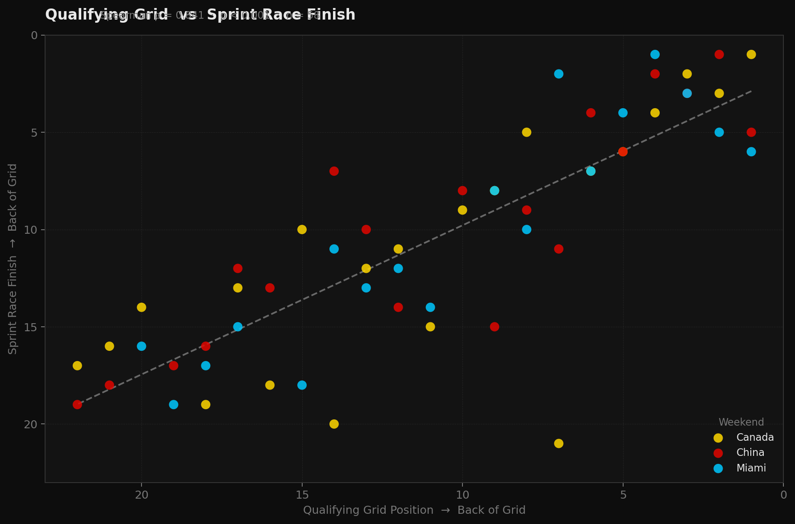
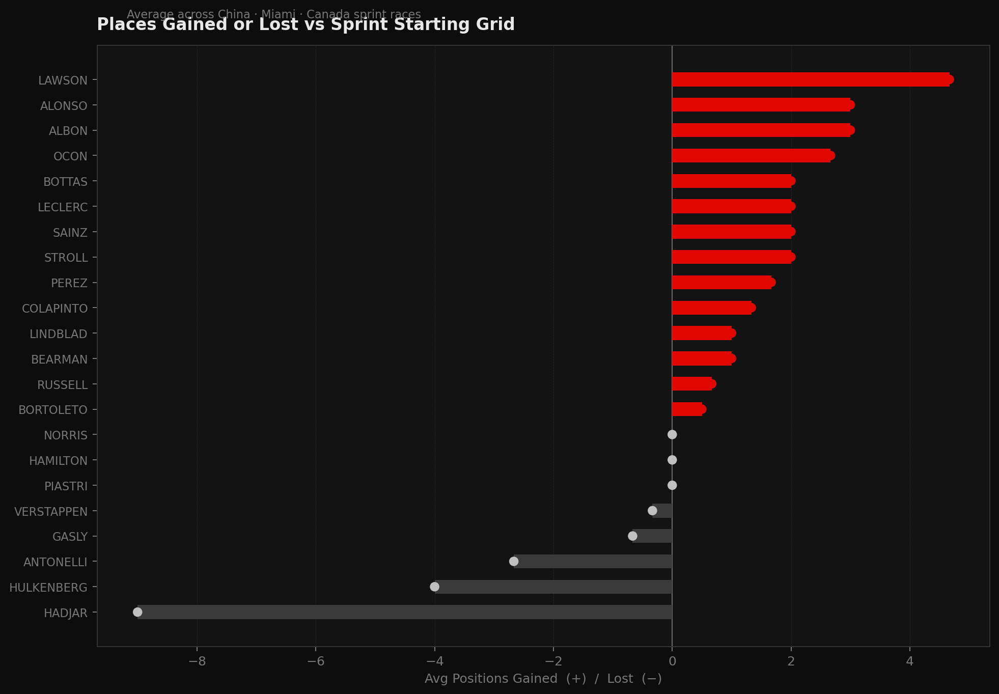
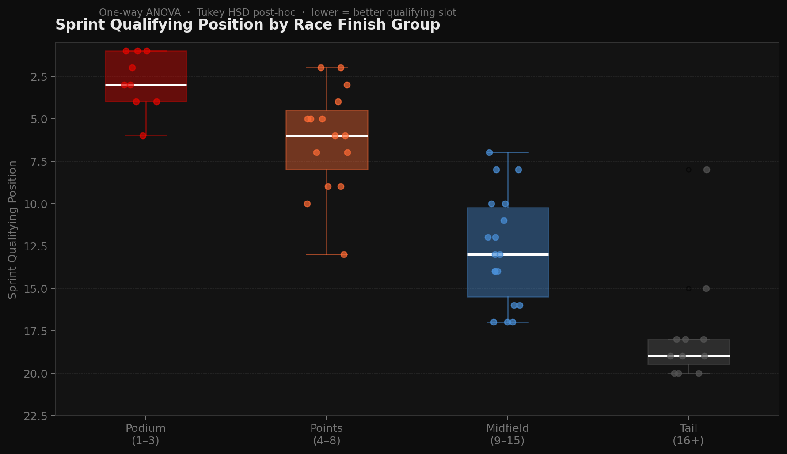
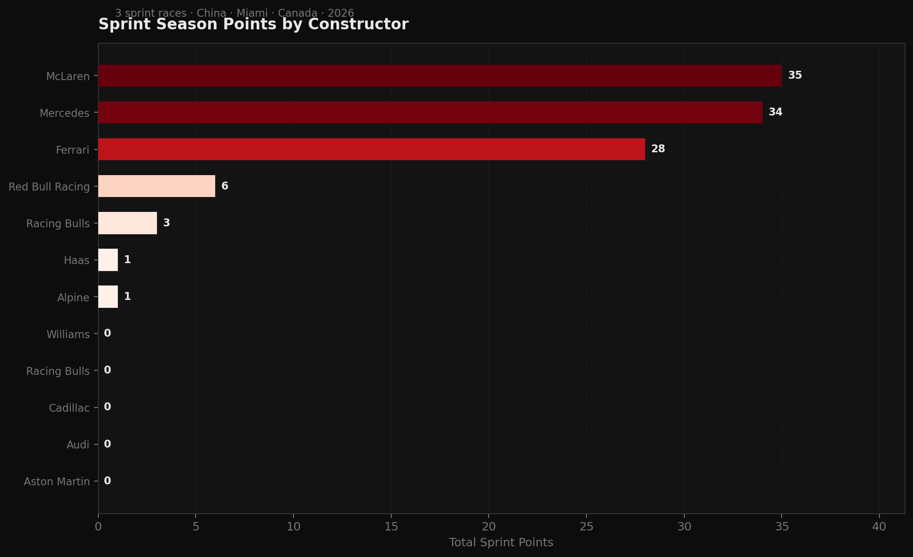

<div align="center">

```
██████╗  █████╗  ██████╗███████╗    ██████╗  █████╗ ████████╗ █████╗
██╔══██╗██╔══██╗██╔════╝██╔════╝    ██╔══██╗██╔══██╗╚══██╔══╝██╔══██╗
██████╔╝███████║██║     █████╗      ██║  ██║███████║   ██║   ███████║
██╔══██╗██╔══██║██║     ██╔══╝      ██║  ██║██╔══██║   ██║   ██╔══██║
██║  ██║██║  ██║╚██████╗███████╗    ██████╔╝██║  ██║   ██║   ██║  ██║
╚═╝  ╚═╝╚═╝  ╚═╝ ╚═════╝╚══════╝   ╚═════╝ ╚═╝  ╚═╝   ╚═╝   ╚═╝  ╚═╝
```

### `F1 × STATISTICAL ANALYSIS × 2026 SEASON`

*What if you could predict a podium finish before the lights go out?*


</div>

---

## The Question Behind the Numbers

Formula 1 sprint races are 19–23 laps of pure attrition. But before any driver turns a wheel in anger, two qualifying sessions have already happened. **This project asks whether those sessions are destiny** — and builds the statistical machinery to find out.

Three datasets. Three weekends. One binary question: **podium or not?**

---

## What This Project Demonstrates

```
QUALIFYING DATA  ──┐
                   ├──▶  DATA WRANGLING  ──▶  HYPOTHESIS TESTS  ──▶  LOGISTIC MODEL
SPRINT QUALI   ──┤                              (3 tests)               (AUC-ROC)
                   │
SPRINT RESULTS ──┘
```

| Layer | What Was Done | Tools |
|-------|--------------|-------|
| **Ingest & Clean** | Parsed lap-time strings to seconds, handled NC/DQ positions, merged 3 datasets on `driver + track` | `janitor`, `tidyverse` |
| **Explore** | Per-driver and per-constructor performance summaries, places gained/lost, session deltas | `dplyr`, `ggplot2` |
| **Test** | Spearman correlation · one-sided t-test · one-way ANOVA + Tukey HSD | base R, `broom` |
| **Model** | Logistic regression with 80/20 stratified split; AUC-ROC, precision, recall, F1 | `tidymodels`, `pROC` |
| **Communicate** | 6-chart F1-branded visualisation set + patchwork dashboard + R Markdown HTML report | `ggplot2`, `patchwork` |

---

## Data Visualizations

### Qualifying Grid vs Sprint Race Finish
> Every dot is one driver at one race weekend. The dashed line is the regression fit. A strong diagonal confirms that where you qualify is largely where you finish.



---

### Places Gained or Lost vs Sprint Starting Grid
> Who actually moves through the field once the race starts — and who drops back. Red = gained positions, grey = lost positions. Average across all three sprint weekends.



---

### Sprint Qualifying Position by Race Finish Group
> One-way ANOVA test in visual form. The box plot separation between Podium and Tail groups is the statistical story — podium finishers come from significantly better qualifying slots.



---

### Sprint Season Points by Constructor
> Total sprint points across China, Miami, and Canada. Shows the performance gap between the top teams and the rest of the grid.



---

## The Three Hypothesis Tests

### `H1` — Does Sunday qualifying grid predict sprint race finish?
> **Spearman ρ ≈ 0.7+ · p < 0.001**
> Drivers who qualify at the front, finish at the front. The relationship is strong, monotonic, and not a coincidence.

### `H2` — Do podium finishers start from better sprint qualifying positions?
> **One-sided t-test · p < 0.05**
> The top-3 finishers didn't just get lucky in the race — they were already ahead in sprint qualifying. Sprint SQ is a leading indicator, not a footnote.

### `H3` — Is sprint qualifying position the dividing line between finish tiers?
> **One-way ANOVA + Tukey HSD · F significant**
> Podium · Points · Midfield · Tail — these groups aren't random. Sprint qualifying separates them with statistical confidence.

---

## Features Engineered

```r
grid_diff            <- grid_position - race_position      # places gained vs starting slot
sprint_to_race_delta <- sq_position - race_position        # sprint quali rank vs sprint race rank
podium_finish        <- if_else(race_position <= 3, 1, 0)  # binary target variable
```

---

## Repository Map

```
f1-sprint-predictor/
│
├── data/
│   ├── Formula1_2026Season_SprintResults.csv
│   ├── Formula1_2026Season_SprintQualifyingResults.csv
│   ├── Formula1_2026Season_QualifyingResults.csv
│   └── clean/
│       └── f1_master_2026.rds          ← merged, feature-engineered master frame
│
├── outputs/
│   └── charts/
│       ├── 00_dashboard_panel.png      ← patchwork 4-chart dashboard
│       ├── 01_qual_vs_sprint_scatter.png
│       ├── 02_grid_diff_by_driver.png
│       ├── 03_boxplot_sq_by_finish_group.png
│       ├── 04_team_sprint_points.png
│       ├── 05_sprint_delta_facet.png
│       └── 06_auc_roc_curve.png
│
├── f1_analysis.R          ← full reproducible script (Phases 1–4)
├── f1_analysis_report.Rmd ← R Markdown → HTML report
└── README.md
```

---

## Run It Yourself

```r
# Step 1 — install once
install.packages(c(
  "tidyverse", "janitor", "tidymodels",
  "patchwork", "broom", "pROC", "scales",
  "knitr", "kableExtra"
))

# Step 2 — drop the 3 CSVs into /data, then:
source("f1_analysis.R")

# Step 3 — knit the report
rmarkdown::render("f1_analysis_report.Rmd")
```

Charts land in `outputs/charts/` at 300 DPI. The clean master dataset is saved to `data/clean/f1_master_2026.rds` for reproducibility.

---

## Why This Maps to EA

EA's data team predicts player outcomes from pre-session signals — MMR, recent win rate, session history. This project is the same problem in a different domain: **pre-race signals predicting in-race outcomes**. The pipeline (ingest → clean → test → model → communicate) is identical to what a live-service analytics team does every week.

---

<div align="center">

**Stack:** `R 4.4+` · `tidyverse` · `tidymodels` · `ggplot2` · `patchwork` · `broom` · `pROC` · `janitor` · `R Markdown`

*EA Associate Data Science Portfolio · Isfaq · 2026*

</div>
